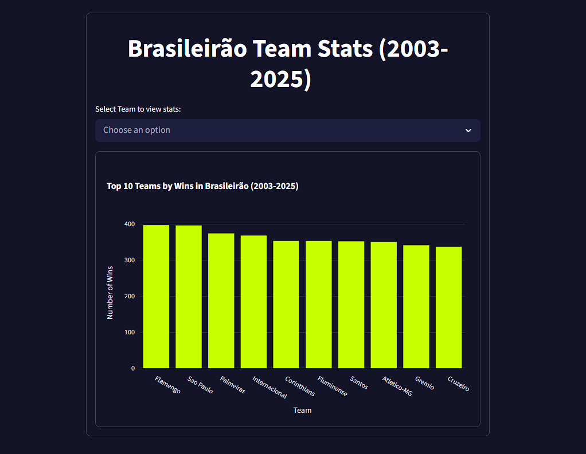
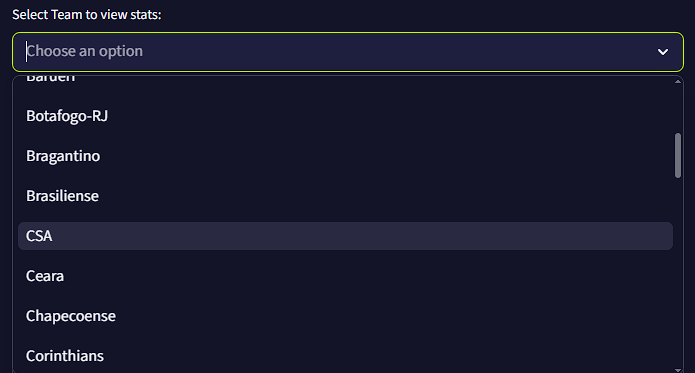
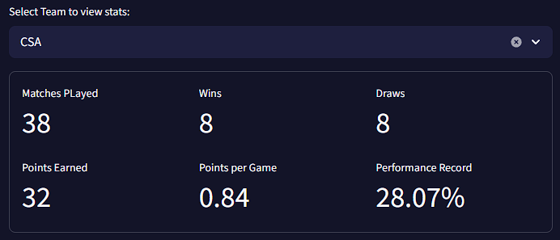
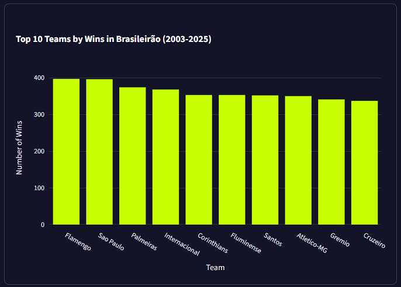

# Brasileirao Stats (2003-2025)



> A simple Python project to analyse stats from Brazilian Football League using Pandas, Dataset from Kaggle and Streamlit.
> Dataset: Campeonato Brasileiro de Futebol por Adão Duque (Kaggle)

https://brasileirao-stats.streamlit.app/

## ⚙️ Project Structure

```bash
brasileirao-stats/
├── data/                  # CSV datasets from Kaggle
├── docs/                  # Screenshots and documentation images
├── .streamlit/            # Streamlit configuration
├── .gitignore
├── app.py                 # Streamlit application and visualizations
├── main.py                # Data processing and analysis logic
├── requirements.txt       # Python dependencies
├── LICENSE
└── README.md
```

## 🔧 Used Tools

> [!IMPORTANT]
> - Python (Python 3.11.9 was the used in this project)
> - Streamlit
> - Pandas
> - Plotly

## 🕹️ Features

Streamlit Select Box

> The user can choose which team to see the stats from list given to selectbox


> After choosing, the team averages should appear in the centered container in the page with the most important stats and averages.


> In the bottom of the page the user can see a graph made with Plotly showing the top 10 teams with most wins in the period.

## 🍴 How to Run Locally

- First thing you've got to do is fork the project to use on your own repository, this way you can change the project the way you want
- After forking and cloning, you open the project in your terminal and create a virtual environment (venv)
- Run venv

Commonly used command in terminal:

```bash
venv/scripts/activate
```

- You'll need to use a few dependencies in order for the project to work correctely, you can use the command below

```bash
pip install pandas streamlit plotly
```

- After everything is set-up, you go back to your terminal and run the command:

```bash
streamlit run app.py
```

- The project now should be working fine through [localhost:8501](http://localhost:8501/) (Should open automatically)

## ✅ Future Intended Updates

- [x] Multilingual Support (Added Portuguese-BR and Español)
- [ ] Player Stats

## ⚖️ License

GNU General Public License v2.0